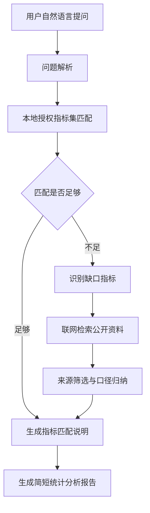

# 指标匹配 Agent 设计

本文档描述一个面向贵州统计指标场景的 Agent。它的核心任务是：先在已有授权指标集中匹配用户问题；如果匹配不足，再到互联网上检索相关指标资料；最后形成一份简短、可追溯的统计分析报告。

## 目标

用户不需要知道准确的指标名称，只需要用自然语言描述分析意图。例如：

```text
我想看贵州文旅消费恢复情况，可以用哪些指标？
```

Agent 需要完成：

- 理解用户问题里的主题、地区、时间、对象和分析目的。
- 优先匹配贵州统计局提供的已有指标。
- 判断现有指标是否足够回答问题。
- 对缺口指标进行联网检索，找到可参考的公开指标、口径或数据来源。
- 输出一份简短统计分析报告，说明使用了哪些指标、为什么选它们、还缺什么数据。

## 工作边界

Agent 不直接伪造数据，也不把网上抓到的内容当成权威统计结果。外部检索结果只能作为补充线索，必须标注来源和不确定性。

对贵州统计局授权指标集，Agent 只通过后端接口访问，不从 GitHub Pages 静态文件读取。

## 总体流程



## 模块设计

### 1. 问题解析器

输入用户原始问题，提取结构化意图：

```json
{
  "topic": "文旅消费恢复",
  "region": "贵州",
  "time_range": "近几年",
  "analysis_goal": "判断恢复情况",
  "keywords": ["旅游收入", "游客人数", "消费", "恢复"],
  "constraints": ["优先使用贵州统计指标"]
}
```

解析结果用于后续指标检索、联网搜索和报告组织。

### 2. 授权指标匹配器

从后端加载贵州统计局指标集后，对每个指标计算匹配分。建议结合三类信号：

- 语义相似度：用户问题与指标名称、指标解释、主题分类之间的向量相似度。
- 关键词命中：地区、行业、人口、经济、投资、消费等词汇匹配。
- 口径适配：指标是否能直接支撑用户的分析目标。

输出结构：

```json
{
  "matched_metrics": [
    {
      "name": "旅游总收入",
      "source": "贵州统计局授权指标集",
      "match_score": 0.91,
      "reason": "能够直接反映旅游消费规模变化"
    }
  ],
  "coverage": "partial",
  "missing_aspects": ["游客结构", "人均消费", "跨省对比"]
}
```

### 3. 缺口判断器

当出现以下情况时，进入联网检索：

- 最高匹配分低于阈值，例如 `0.75`。
- 指标只能回答一部分问题，覆盖度为 `partial`。
- 用户明确要求比较外部地区、行业标准或最新公开情况。
- 本地指标集中缺少口径说明、年份范围或来源解释。

缺口判断不应只看分数，还要看“能否支撑报告结论”。

### 4. 联网检索器

联网检索用于补充公开指标情况，不替代授权指标库。

优先检索来源：

- 国家统计局、贵州省统计局等官方统计网站。
- 政府公开报告、统计公报、年鉴说明。
- 行业主管部门发布的公开数据或指标口径。
- 高可信研究机构报告。

检索时记录：

```json
{
  "query": "贵州 旅游收入 游客人数 统计公报",
  "title": "贵州省国民经济和社会发展统计公报",
  "url": "https://example.gov.cn/...",
  "publisher": "政府公开网站",
  "published_at": "2025-03-01",
  "summary": "包含旅游收入、接待游客等相关描述",
  "reliability": "high"
}
```

### 5. 来源筛选与口径归纳

联网结果进入报告前，需要做一次筛选：

- 去掉来源不明、广告站、转载无法追溯的页面。
- 优先保留官方来源。
- 对同名指标标出口径差异。
- 对时间范围不一致的数据做提醒。
- 不把未经核验的网页数字直接写成确定结论。

### 6. 报告生成器

报告应短、清楚、可追溯。建议固定为五段：

1. 问题理解：复述用户要分析什么。
2. 推荐指标：列出本地授权指标集中匹配到的指标。
3. 补充指标：列出联网检索发现但本地缺少或需要补充的指标。
4. 初步分析：给出可以如何看趋势、结构或对比。
5. 注意事项：说明口径、年份、来源和数据缺口。

报告示例：

```text
用户问题关注贵州文旅消费恢复情况。现有指标中，建议优先使用旅游总收入、接待游客人次、限额以上住宿餐饮业营业额等指标。

这些指标分别反映消费规模、客流恢复和相关服务业经营情况。其中旅游总收入与接待游客人次可以作为主指标，住宿餐饮业指标可作为侧面验证。

联网检索显示，公开统计公报中还常使用人均旅游消费、国内游客与入境游客结构等指标。若授权指标集中没有这些字段，建议作为补充指标或后续采集项。

初步分析可从三步展开：先看近三年总量恢复，再看人均消费是否同步恢复，最后与周边省份或全国趋势对比。

需要注意的是，不同来源对旅游收入、游客人次的统计口径可能不同，正式报告中应以贵州统计局授权数据为准，外部资料只作为补充参考。
```

## Agent 状态

一次任务建议保存以下状态，便于追溯：

```json
{
  "question": "用户原始问题",
  "parsed_intent": {},
  "local_matches": [],
  "coverage": "full | partial | low",
  "web_search_needed": true,
  "web_sources": [],
  "final_report": "",
  "warnings": []
}
```

## 后端接口建议

前端只负责展示和输入，Agent 逻辑建议放在后端。

建议接口：

```text
POST /api/agent/ask
GET  /api/metrics
POST /api/search
POST /api/report
```

`POST /api/agent/ask` 可以作为总入口：

```json
{
  "question": "我想分析贵州人口老龄化趋势",
  "metric_token": "用户指标集访问令牌",
  "options": {
    "allow_web_search": true,
    "report_style": "brief"
  }
}
```

返回：

```json
{
  "answer": "简短回答",
  "matched_metrics": [],
  "supplementary_metrics": [],
  "sources": [],
  "report": "统计分析报告正文"
}
```

## 权限与安全

- 指标集令牌必须由后端校验。
- 前端不保存长期有效的指标集令牌。
- 外部检索需要记录来源 URL 和访问时间。
- 报告中区分“授权指标”“公开补充资料”“模型推断”。
- 对无法确认的数据，应写明“不足以直接下结论”。

## 第一阶段实现建议

第一阶段不必一次做完整 Agent，可以先做一个可靠闭环：

1. 用户提问。
2. 后端读取授权指标集。
3. 返回本地指标匹配结果。
4. 若匹配不足，生成需要联网检索的关键词。
5. 人工或后端检索公开来源。
6. 生成一页简短报告。

等这个闭环跑通后，再把联网检索和报告生成自动化。
